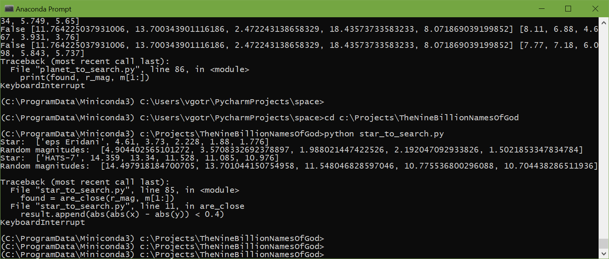

Sometimes it's much more interesting to read books and play than use resources to generate cryptocurrencies and then use of them in wrong way (especially at Dark Web). 

I dodn't generate cryptocurrencies and don't want to use them until we will have a basic control on that!

This script just making random magnitudes and trying to find the most close known star (who knows - this can be a star with aliens ;)). Chance to find it minimal ;)

Inspired by "The Nine Billion Names of God" of  Arthur C. Clarke - https://en.wikipedia.org/wiki/The_Nine_Billion_Names_of_God

I got 2 cases almost at start (and this is very very strange - because chance is very very minimal):

Star:  ['eps Eridani', 4.61, 3.73, 2.228, 1.88, 1.776]
Random magnitudes:  [4.904402565101272, 3.5708332692378897, 1.988021447422526, 2.192047092933826, 1.5021853347834784]

Star:  ['HATS-7', 14.359, 13.34, 11.528, 11.085, 10.976]
Random magnitudes:  [14.497918184700705, 13.701044150754958, 11.548046828597046, 10.775536800296088, 10.704438286511936]

Screenshot:
